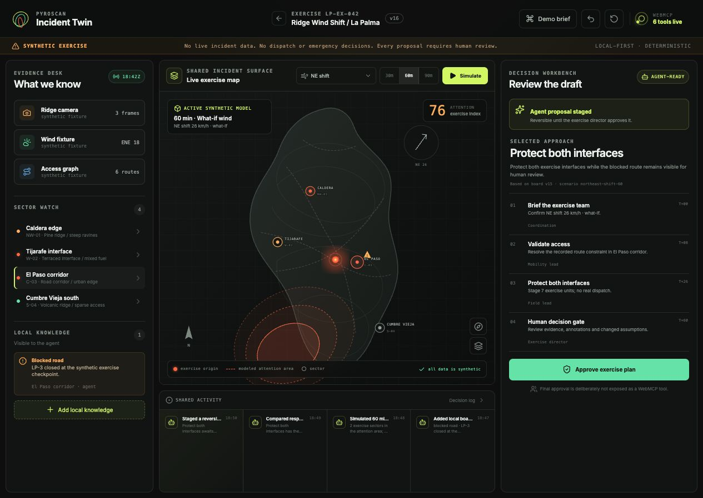

# PyroScan // Incident Twin

> **A shared wildfire rehearsal table for people and AI agents.**

PyroScan Incident Twin is an agent-native, browser-only exercise environment built for the [OpenAI WebMCP Challenge](https://webmcp.devpost.com/). A human and an AI agent inspect the same evidence, explore deterministic what-if scenarios, compare response options, and prepare a reversible briefing on one shared map.

**[Open the live WebMCP app →](https://sebastianfernandezgarcia.github.io/pyroscan-incident-twin/)**



## Why WebMCP matters here

A wildfire exercise is not a sequence of anonymous clicks. The intent is richer: *inspect this sector*, *simulate a bounded wind shift*, *compare these strategies*, or *stage a plan from the current evidence*.

WebMCP gives the agent those exact operations while keeping the normal interface for people. Both work with the same in-memory board:

- An agent action visibly changes the map, cards, draft and decision log.
- A human annotation immediately becomes part of later simulations and plans.
- Every consequential proposal is reversible.
- `boardVersion` rejects plans derived from stale state.
- Final approval is intentionally available only to the human.

This is not a chatbot layered over a dashboard. WebMCP calls the same domain actions as the visual interface.

## The six site tools

| Tool | Purpose | Board effect |
| --- | --- | --- |
| `read_incident_board` | Read the compact shared state and current `boardVersion` | None |
| `inspect_zone` | Focus a sector and return its evidence and annotations | Visual focus only |
| `simulate_spread` | Draw a deterministic 30/60/90-minute what-if | Replaces active scenario |
| `compare_response_options` | Score two or three bounded response options | Opens comparison |
| `stage_response_plan` | Stage a reversible plan against an exact board version | Creates human-reviewable draft |
| `add_board_annotation` | Pin a route, asset or local-knowledge constraint | Updates later analysis; invalidates stale drafts |

There is deliberately **no `approve_plan` tool**. The exercise director completes that decision gate in the human interface.

See [WebMCP implementation notes](docs/WEBMCP_IMPLEMENTATION.md) for schemas, lifecycle and safety details.

## Try the collaboration loop

Open the app in a WebMCP-compatible browser and ask:

> Inspect El Paso. Add a blocked-road exercise note for the LP-3 checkpoint. Simulate a 60-minute northeast wind shift, compare the ridge and dual-interface options, then stage the safest reversible plan.

Watch the same journey unfold on screen: El Paso focuses, a warning appears, contours move, option cards rerank, and a draft opens for human approval.

## Run locally

Requirements: Node.js 20+ and npm.

```bash
git clone https://github.com/sebastianfernandezgarcia/pyroscan-incident-twin.git
cd pyroscan-incident-twin
npm install
npm run dev
```

Then open the printed local URL.

### Quality checks

```bash
npm test
npm run lint
npm run build
```

The production build is static and can be deployed to Netlify, Cloudflare Pages, Vercel or any static host. Use `npm run build` and publish `dist/`.

## Test with WebMCP

### ChatGPT desktop browser

1. Update ChatGPT desktop to a version with Site Tools support.
2. Use GPT-5.6 Sol or GPT-5.6 Terra.
3. Open the deployed app in the built-in browser.
4. Inspect **Site tools** in the address bar; six PyroScan tools should appear.
5. Send the prompt above.

### Chrome

Use a Chrome build with WebMCP enabled according to the current [Chrome WebMCP guide](https://developer.chrome.com/docs/ai/webmcp/imperative-api).

The app still works as a complete visual exercise when `document.modelContext` is unavailable. The header then shows **browser preview** rather than **6 tools live**.

## Safety and domain honesty

- Every fixture and projection is explicitly synthetic.
- The spread contours are deterministic exercise attention areas, not forecasts or observed perimeters.
- The app has no live feeds, credentials, backend, dispatch integration or emergency-alert capability.
- Tool inputs are narrow, runtime-validated and bounded.
- Human-authored annotations are marked as untrusted tool content.
- Tool registration is tied to one `AbortController` and removed on page exit.
- Plan staging requires exact current-state lineage via `boardVersion`.
- Final approval stays human-only.

## Architecture

- React 19 + TypeScript + Vite
- Zustand vanilla store shared by React and WebMCP
- Custom SVG incident map with no tile/API dependency
- Deterministic local scenario engine
- Imperative `document.modelContext.registerTool` integration
- Vitest + Testing Library

No API key or backend is required.

## Built during the challenge

This repository is a clean, public competition build created during the challenge window. It is inspired by prior PyroScan research, but the standalone browser-only product, deterministic exercise domain, shared map, stale-state protocol, WebMCP tools, tests and public documentation in this repository were built for this challenge.

See [CHALLENGE_WORK.md](CHALLENGE_WORK.md) for the exact scope.

## Documentation

- [WebMCP implementation](docs/WEBMCP_IMPLEMENTATION.md)
- [Demo script under three minutes](docs/DEMO_SCRIPT.md)
- [Devpost submission copy](docs/DEVPOST_SUBMISSION.md)
- [Release checklist](docs/RELEASE_CHECKLIST.md)

## License

[MIT](LICENSE) © 2026 Sebastián Fernández García.

---

**Exercise only. No live incident data. No dispatch or emergency decisions.**
